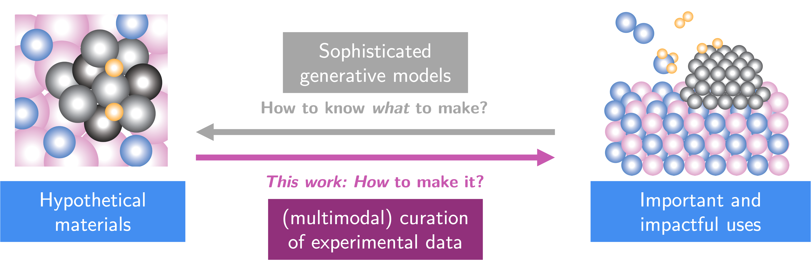

# LeMaterial-Synthesis

An open-source multi-modal toolbox for extracting structured synthesis procedures and performance data from materials science literature at scale. This repository contains the implementations of [LeMat-Synth v1.0](https://arxiv.org/abs/2510.26824) (published on the arXiv and presented at NeurIPS AI4Mat 2025) plus the extendable codebase for usecases in materials science.

## How it works

```
Paper (PDF or text)
      │
      ▼
 Material Extraction   ← "Which materials were synthesized?"
      │                   → ["Fe2O3", "3%Ru/CaO"]
      │ for each material
      ▼
 Synthesis Extraction  ← "How was Fe2O3 made?"
      │                   → steps, reagents, conditions, equipment
      ▼
 Judge Evaluation      ← Quality score 1–5 per dimension
      │
      │  (optional: --with-performance)
      ▼
 Figure Extraction     ← Finds plots in the paper
      ▼
 Plot Data Extraction  ← Reads x/y values from each plot via VLM
      ▼
 Performance Linking   ← Matches plot series to materials
      │
      ▼
 results/<paper>/<material>.json
```

## Which workflow is right for you?

| My situation | What to use |
|---|---|
| Try the tool on **one paper** first | `examples/notebooks/00_quickstart.ipynb` |
| I have a **folder of PDFs** | `lemat-synth batch /pdfs/ results/ --domain catalysis` |
| I have **plain text files** | `lemat-synth batch /texts/ results/` |
| I want full Hydra config control | `examples/scripts/deployment/extract_synthesis_procedure_from_text.py` |
| **Catalysis** end-to-end case study | `examples/scripts/case_study_thermocatalysis/run_all_papers.py` |
| **Superconductors** Tc extraction | `examples/scripts/case_study_superconductors/batch_run_tc.py` |

→ See [examples/README.md](examples/README.md) for a complete navigation guide.

## What does the output look like?

Each result file is a JSON with the extracted synthesis procedure:

```json
{
  "material": "3%Ru/CaO",
  "synthesis": {
    "synthesis_method": "wet impregnation",
    "starting_materials": [
      {"name": "RuCl3", "amount": 0.12, "unit": "g", "purity": "99%"},
      {"name": "CaO",   "amount": 1.0,  "unit": "g"}
    ],
    "steps": [
      {"step_number": 1, "action": "dissolve",   "conditions": {"temperature": 25,  "temp_unit": "C", "duration": 30,  "time_unit": "min"}},
      {"step_number": 2, "action": "impregnate", "conditions": {"stirring": true,   "duration": 2,   "time_unit": "h"}},
      {"step_number": 3, "action": "dry",        "conditions": {"temperature": 110, "temp_unit": "C", "duration": 12,  "time_unit": "h"}},
      {"step_number": 4, "action": "calcine",    "conditions": {"temperature": 500, "temp_unit": "C", "duration": 4,   "time_unit": "h", "atmosphere": "air"}}
    ]
  },
  "evaluation": {"overall_score": 4.7}
}
```

→ See [docs/user-guide/output-format.md](docs/user-guide/output-format.md) for a field-by-field explanation.

## Approximate API costs per paper

| Model | Synthesis only | + Performance linking |
|---|---|---|
| `gemini-2.5-flash-lite` | ~$0.01 | ~$0.05 |
| `gemini-2.0-flash` (default) | ~$0.03 | ~$0.10 |
| `gemini-2.5-flash` | ~$0.05 | ~$0.15 |
| `claude-sonnet-4.6` | ~$0.10 | ~$0.25 |

Costs depend on paper length and the number of materials. Test on a small batch first
(`lemat-synth batch ... --max 5`). Performance linking adds cost because Claude reads
each figure image.



[](https://arxiv.org/abs/2510.26824)
[](https://huggingface.co/datasets/LeMaterial/LeMat-Synth)

---

## Quick Start

<details>
<summary><b>Installation Instructions</b></summary>

### Prerequisites

This project uses **uv** as a package & project manager. See [uv's README](https://github.com/astral-sh/uv?tab=readme-ov-file#installation) for installation instructions.

### Setup
```bash
# 1. Clone & enter the repo
git clone https://github.com/LeMaterial/lematerial-llm-synthesis.git
cd lematerial-llm-synthesis

# 2. (First time only) create & seed venv
uv venv -p 3.11 --seed

# 3. Install dependencies & package
uv sync && uv pip install -e .
```

### API Key Configuration

<details>
<summary><b>macOS/Linux</b></summary>
```bash
cp .env.example .env
# Edit `.env` to add:
#   MISTRAL_API_KEY=your_api_key # if using Mistral models and Mistral OCR
#   OPENAI_API_KEY=your_api_key # if using OpenAI models
#   GEMINI_API_KEY=your_api_key # if using Gemini models
#   ANTHROPIC_API_KEY=your_api_key # if using Anthropic models (Claude, image extraction)
```

Before running the scripts, you need to load your API keys. For this you need to source the .env file. Run:
```bash
source .env
```

</details>

<details>
<summary><b>Windows</b></summary>

- Search bar → Edit the system environment variables → Advanced → click "Environment Variables..."
- Under "User variables for <your-username>" click "New" and add each:
  - Variable name: `MISTRAL_API_KEY`; Value: `your_api_key`
  - Variable name: `OPENAI_API_KEY`; Value: `your_api_key`
  - Variable name: `GEMINI_API_KEY`; Value: `your_api_key`
  - Variable name: `GOOGLE_APPLICATION_CREDENTIALS`; Value: `C:\path\to\service-account.json`

</details>

**Note:** For any platform you can always load .env-style keys in code via `os.environ.get(...)`.

### Verify Installation
```bash
uv run python -c "import llm_synthesis"
```

No errors? You're all set!

</details>

---

## Dataset Access

<details>
<summary><b>Fetching HuggingFace Dataset LeMat-Synth</b></summary>

The data is hosted as a LeMaterial Dataset on HuggingFace: [LeMat-Synth](https://huggingface.co/datasets/LeMaterial/LeMat-Synth/)

### Access Steps

1. **Apply for access** (request will be instantly approved)
2. **Install HuggingFace CLI** ([guide](https://huggingface.co/docs/huggingface_hub/en/guides/cli))
   - Recommended: `pip install -U "huggingface_hub[cli]"`
   - Or (macOS): `brew install huggingface-cli`
3. **Login with access token**: `huggingface-cli login`

### Available Datasets

- **[LeMat-Synth](https://huggingface.co/datasets/LeMaterial/LeMat-Synth/)**: Synthesis procedures and images in structured (per-synthesis) format
- **[LeMat-Synth-Papers](https://huggingface.co/datasets/LeMaterial/LeMat-Synth-Papers/)**: Intermediate dataset storing papers in per-paper format

</details>

---

## Usage

### Extract from HuggingFace Dataset
```bash
uv run examples/scripts/deployment/extract_synthesis_procedure_from_text.py \
  data_loader=default \
  synthesis_extraction=default \
  material_extraction=default \
  judge=default \
  result_save=default
```

### Extract Synthesis Locally
```bash
uv run examples/scripts/deployment/extract_synthesis_procedure_from_text.py \
  data_loader=local \
  data_loader.architecture.data_dir="/path/to/markdown" \
  synthesis_extraction=default \
  material_extraction=default \
  judge=default \
  result_save=default
```

### Extract Images Locally

*Work in Progress*


### Thermocatalysis Case Study

Extracts synthesis procedures and catalytic performance data (conversion/selectivity vs temperature curves) from a local corpus of heterogeneous catalysis papers (PDFs not part of the open-source LeMat-Synth-Papers corpus).

**Scripts** — [`examples/scripts/case_study_thermocatalysis/`](examples/scripts/case_study_thermocatalysis/)

| Script / Notebook | What it does |
|---|---|
| `run_all_papers.py` | Full synthesis + performance extraction on a local folder of PDFs → per-paper JSON results |
| `catalysis_synthesis_with_performance.ipynb` | Step-by-step interactive extraction for a single paper |
| `catalysis_map_notebook.ipynb` | Visualizations: conversion landscape, per-metal subplots |
| `keyword_search.py` | *(Experimental)* Keyword filtering of LeMat-Synth-Papers — not used in the main pipeline |
| `downsample_with_llm.py` | *(Experimental)* LLM screening for performance-vs-temperature plots — not used in the main pipeline |

**Run extraction** on your local PDF corpus:
```bash
uv run examples/scripts/case_study_thermocatalysis/run_all_papers.py \
  /path/to/catalysis_corpus \
  /path/to/results_catalysis/ \
  --skip-existing
```
For each paper the script saves:
- `<output_dir>/<paper_id>/<material>.json` — synthesis procedure + evaluation score per material
- `<output_dir>/<paper_id>/performance_mappings.json` — plot series linked to materials
- `<output_dir>/<paper_id>/linking_summary_llm.json` — LLM quality evaluation
- `<output_dir>/<paper_id>/linking_summary_human.json` — blank template for human annotation
- `<output_dir>/batch_summary.json` — overall batch statistics

Additional flags: `--max N` to limit to the first N papers, `--skip-existing` to resume an interrupted run.

**Explore results interactively:**
- Open `catalysis_synthesis_with_performance.ipynb` to walk through every extraction step on a single paper (PDF → materials → synthesis → figures → plot data → linking).
- Open `catalysis_map_notebook.ipynb` to produce publication-quality conversion landscape and per-metal subplot figures from the batch results.

---

### Superconductor Case Study

Extracts synthesis procedures and critical temperatures (Tc) from superconductor papers using both text extraction and vision-language model (VLM) reading of ρ(T)/R(T) plots.

**Scripts** — [`examples/scripts/case_study_superconductors/`](examples/scripts/case_study_superconductors/)

| Script / Notebook | What it does |
|---|---|
| `keyword_search.py` | Filters LeMat-Synth-Papers by "Superconductor" category + "resistivity" keyword → `results/db_superconductors.pkl` |
| `downsample_with_llm.py` | Gemini LLM check for ρ(T)/R(T) plots → filtered dataset on HuggingFace + sample PDFs |
| `batch_run_tc.py` | Full Tc extraction (text + VLM) on PDFs → `tc_master.csv` + per-paper JSONs |
| `batch_run_tc_new_snippet.py` | Enhanced extraction: adds bottom-left crop (snippet) VLM pass + synthesis extraction → `tc_master_snippet.csv` |
| `superconductivity_tc_extraction.ipynb` | Step-by-step interactive extraction for a single paper |
| `superconductivity_tc_extraction_plus_snippet.ipynb` | Same as above with additional snippet-based VLM extraction |
| `visualisation_tc.ipynb` | Visualizations: Tc vs year, text/VLM agreement, synthesis methods |
| `visualisation_tc_with_human_annotation.ipynb` | Same + comparison against human-annotated ground truth |

**Step 1 — Keyword + category filtering** (screens LeMat-Synth-Papers on HuggingFace):
```bash
uv run examples/scripts/case_study_superconductors/keyword_search.py
```
Filters by the "Superconductor" category field and the keyword `"resistivity"` in abstracts. Outputs `results/db_superconductors.pkl` and creates a PR on HuggingFace with the filtered subset.

**Step 2 — LLM downsampling** (requires `GEMINI_API_KEY`):
```bash
# Concise prompt
uv run examples/scripts/case_study_superconductors/downsample_with_llm.py --prompt default

# Detailed prompt with explicit magnetic-field exclusion rules (recommended)
uv run examples/scripts/case_study_superconductors/downsample_with_llm.py --prompt long
```
Uses Gemini to verify each paper contains a ρ(T) or R(T) plot that is not purely a field-sweep study. Pushes the filtered list to HuggingFace and downloads up to 100 sample PDFs.

**Step 3 — Extract Tc from PDFs:**

Standard extraction (text extraction + VLM figure reading):
```bash
uv run examples/scripts/case_study_superconductors/batch_run_tc.py /path/to/superconductor_pdfs
```
Outputs `<pdf_folder>/results/tc_master.csv` with one row per (paper, material).

Enhanced extraction (adds snippet-based VLM crop + synthesis extraction):
```bash
uv run examples/scripts/case_study_superconductors/batch_run_tc_new_snippet.py \
  /path/to/superconductor_pdfs \
  --skip-existing
```
Outputs `<pdf_folder>/results_snippet/tc_master_snippet.csv`.

Additional flags for both batch scripts: `--max N` to limit to the first N papers, `--skip-existing` to resume an interrupted run, `--skip-figures` for text-only mode (no VLM, faster).

**Explore results interactively:**
- Open `superconductivity_tc_extraction.ipynb` for a guided single-paper walkthrough.
- Open `superconductivity_tc_extraction_plus_snippet.ipynb` for the same with the snippet VLM pass.
- Open `visualisation_tc.ipynb` to produce Tc-vs-year scatter plots, text/VLM agreement plots, and synthesis method breakdowns.
- Open `visualisation_tc_with_human_annotation.ipynb` to compare pipeline output against human-annotated ground truth.

### Customize LeMat-Synth

**Change the LLM** — append a model override to any script:
```bash
uv run examples/scripts/deployment/extract_synthesis_procedure_from_text.py \
  synthesis_extraction.architecture.lm.llm_name=claude-sonnet-4.6
```

**Use local files instead of HuggingFace:**
```bash
uv run examples/scripts/deployment/extract_synthesis_procedure_from_text.py \
  data_loader=local \
  data_loader.architecture.data_dir="/path/to/my/text_files"
```

**Use the simple CLI** (no Hydra required):
```bash
lemat-synth extract my_paper.pdf --model gemini-2.5-flash --domain catalysis
lemat-synth batch /papers/ results/ --with-performance --domain electrochemistry
```

**Use the Python API** for full programmatic control:
```python
from llm_synthesis.services.pipelines import SynthesisPerformancePipeline
# See docs/getting-started/quickstart.md and examples/notebooks/00_quickstart.ipynb
```

→ Full guide: [docs/user-guide/configuration.md](docs/user-guide/configuration.md)

---

## 📝 Citation

Cite us:

```bibtex
@article{lederbauer2025lemat,
  title={LeMat-Synth: a multi-modal toolbox to curate broad synthesis procedure databases from scientific literature},
  author={Lederbauer, Magdalena and Betala, Siddharth and Li, Xiyao and Jain, Ayush and Sehaba, Amine and
          Channing, Georgia and Germain, Gr{\'e}goire and Leonescu, Anamaria and Flaifil, Faris and
          Amayuelas, Alfonso and Nozadze, Alexandre and Schmid, Stefan P. and Zaki, Mohd
          and Ethirajan, Sudheesh Kumar and Pan, Elton and Franckel, Mathilde
          and Duval, Alexandre and Krishnan, N. M. Anoop and Gleason, Samuel P.},
  journal={arXiv preprint arXiv:2510.26824},
  year={2025}
}
```
